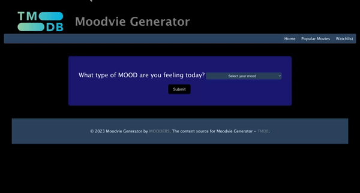

# Moodvie Generator

Moodvie Generator is a delightful web application that helps you discover movies based on your mood. Whether you're feeling happy, sad, excited, or anything in between, Moodvie Generator curates a selection of movies tailored to your emotions. It's your go-to tool for finding the perfect movie to match your mood.

## Table of Contents
- [Features](#features)
- [Demo](#demo)
- [How to Use](#how-to-use)
- [Technologies Used](#technologies-used)
- [Contributions](#contributions)
- [License](#license)
- [Feedback](#feedback)
- [About the Developer](#about-the-developer)

## Features

- **Mood-based Recommendations:** Input your current mood, and Moodvie Generator will suggest movies that align with your emotions.
- **Diverse Genre Selection:** Discover movies from various genres, including drama, comedy, romance, thriller, sci-fi, and more.
- **User-Friendly Interface:** The intuitive and clean design makes it easy to navigate and find the right movie for your mood.
- **Instant Suggestions:** Get instant movie recommendations without the need for sign-ups or logins.
- **Mobile-Friendly:** Access Moodvie Generator on your desktop, tablet, or smartphone for movie suggestions on the go.

## Demo
Homepage:
Popular Movies:
Watchlist: 

## How to Use

1. Visit the [Moodvie Generator](https://bxiong34.github.io/moodvie-generator/) website.
2. Select your current mood from the options provided.
3. Click the "Generate Moodvie" button to receive personalized movie recommendations.
4. Explore the suggested movies and find the perfect film to match your mood.
5. Enjoy your movie time!

## Technologies Used

Moodvie Generator is built using cutting-edge web technologies, ensuring a seamless user experience:

- **Frontend:** HTML, CSS, JavaScript
- **Hosting:** GitHub Pages

## Contributions

Contributions to Moodvie Generator are welcome! If you have any ideas for features or improvements, feel free to open an issue or submit a pull request on the [GitHub repository](https://github.com/bxiong34/moodvie-generator). Let's make Moodvie Generator even better together!

## License

Moodvie Generator is licensed under the **MIT License**:

## Feedback

Have feedback or suggestions? We'd love to hear from you! Feel free to reach out through the [GitHub repository](https://github.com/bxiong34/moodvie-generator) or contact the developer directly.

## About the Developer

Moodvie Generator is developed and maintained by [Jimenez, David/ Matheson, Isabella/ Xiong, Bao]. To learn more about the developer and their other projects, visit their [David GitHub profile](https://github.com/DavidJ92), [Bao GitHub profile](https://github.com/bxiong34), [Isabella GitHub profile](https://github.com/zamatheson)

---

**Explore movies that match your mood with Moodvie Generator! Have a great time watching!**

